# Clothing Ranked Retrieval

## TODO: Clothing Information Retrieval Project

- [x] Implement corpus loader for `DOCID`, title/category, and description.

- [x] Implement preprocessing:
  - [x] Convert text to lowercase.
  - [x] Tokenize text.
  - [x] Remove punctuation.
  - [x] Decide and document the stop-word policy.
  - [x] Apply stemming.

- [x] Build the inverted index:
  - [x] Store term frequency.
  - [x] Store document frequency.

- [x] Store document lengths for cosine normalization.

- [x] Implement `lnc.ltc` cosine-similarity ranking.

- [x] Return the top 10 documents for each free-text query.

- [x] Build the positional index with token positions.

- [x] Implement exact phrase search.

- [x] Implement ordered proximity search with different `k` values.

- [x] Add novelty backend extension:
  - [x] Implement content-based similar product recommendation using vector space similarity.
  - [x] Implement optional metadata filtering (e.g. by category).

- [x] Create a simple interface supporting:
  - [x] Free-text search.
  - [x] Phrase search.
  - [x] Proximity search.
  - [x] Displaying scores and matching positions.

- [x] Test the system with:
  - [x] 10 free-text queries.
  - [x] 5 phrase queries.
  - [x] 3 proximity queries with different `k` values.
  - [x] 1 out-of-vocabulary query.

- [x] Compare ordinary retrieval and positional retrieval using two examples.

## Stop-word policy

The corpus was analysed automatically using the existing corpus loader. The analysis included every document title, category, and description, then converted the text to lowercase and tokenized it with a basic alphabetic-token pattern. NLTK's English stop-word list was compared with the tokens found in the corpus, and each matching word was reviewed before making a decision.

The selected stop words are: `and`, `be`, `can`, `for`, `from`, `in`, `is`, `it`, `on`, `or`, `other`, `the`, `this`, and `with`. These are ordinary grammatical words in this corpus.

`m` and `s` are retained because they appear as clothing sizes. `t` is also retained because it can be part of the product term T-Shirt.

## Preprocessing

Preprocessing decisions made aside from normal procedure:

- Treat `t-shirt`, `t shirt`, and `tshirt` as the same clothing term: `tshirt`.
- Remove apostrophes, so words such as `men's` and `women's` become `mens` and `womens`.
- Keep alphabetic and numeric tokens because sizes and numeric product details may be useful for retrieval.

## Search Interface and Query Modes

The Streamlit user interface provides three distinct search modes according to the assignment requirements:

### 1. Free-Text Ranked Retrieval (VSM lnc.ltc)
Retrieves the top 10 relevant documents ranked by cosine similarity with document and query weights.

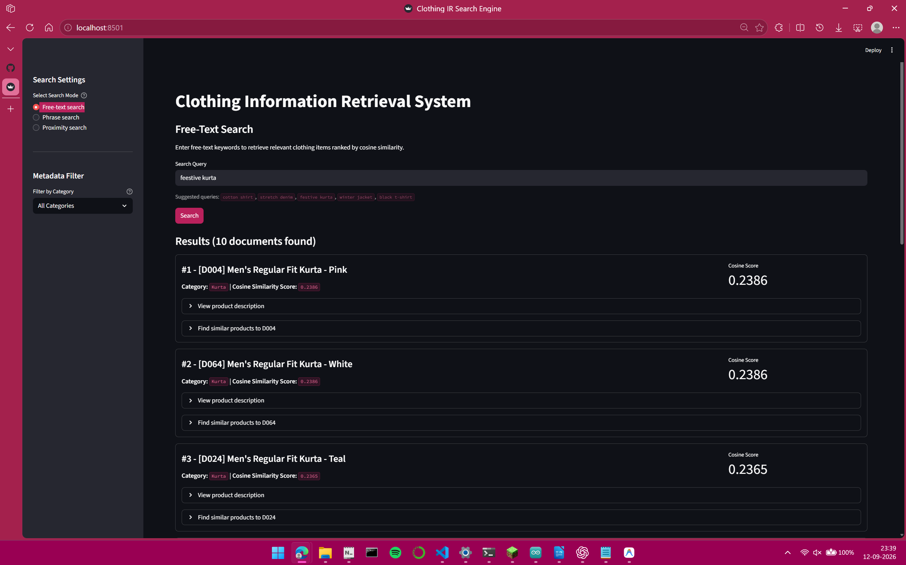

### 2. Exact Phrase Search (Positional Index)
Finds documents where all query terms occur in exact consecutive order, displaying matching phrase start positions.

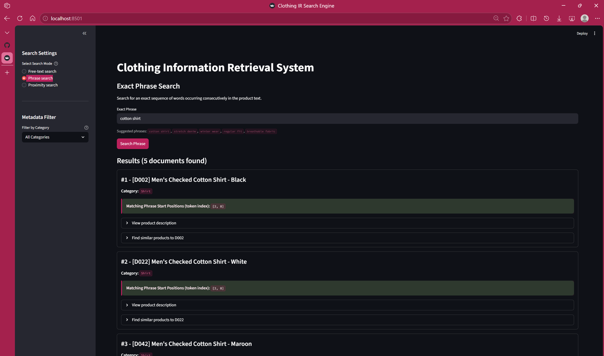

### 3. Ordered Proximity Search (WITHIN/k)
Finds documents where the first term occurs before the second term within at most k token positions, displaying matching token pairs and distance.

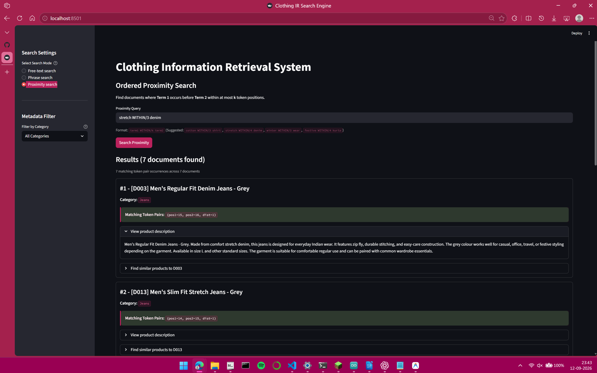

## Novelty Extension: Product Recommendations and Metadata Filtering

An optional backend module was added in `src/recommender.py` to extend the clothing search engine beyond the core requirements:

- Content-based recommendations: Given a target product, it calculates cosine similarity against other products using the existing inverted index and lnc document weights. It returns the top similar items with their titles, categories, and similarity scores, excluding the target item itself. Ties are broken by increasing document ID.

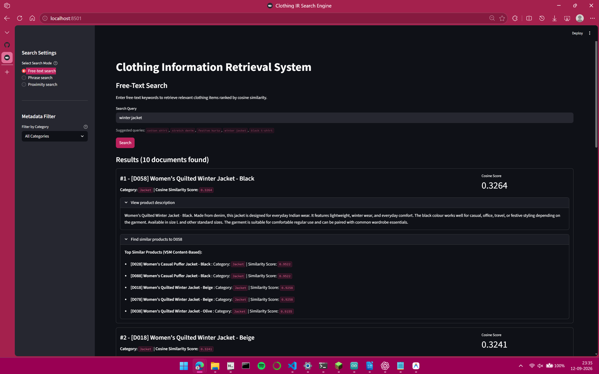

- Metadata filtering: Filters the corpus documents by attributes such as category before retrieval. It matches values case-insensitively and returns allowed document IDs so the interface or recommender can narrow down results when requested.

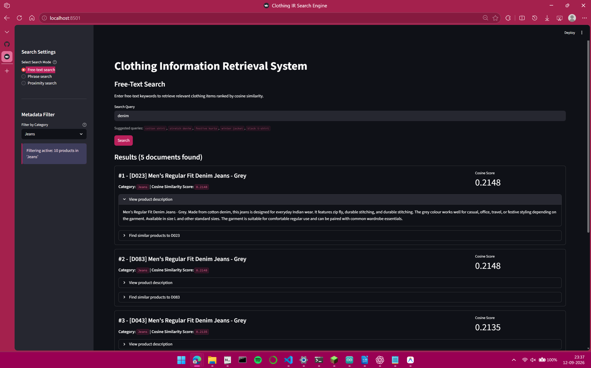

## Comparative Analysis: Vector Space Model vs. Positional Retrieval

Disclaimer: Browser zoom was minimized while capturing screenshots so all top result cards fit into view without scrolling, so text and interface elements may appear small.

The assignment requires reporting the top-10 results and explaining at least two cases where positional information changes the result set or ordering.

### Case 1: Term Proximity and Precision (Query: `cotton t-shirt`)

- Free-Text VSM Search: Entering `cotton t-shirt` retrieves 10 documents based on cosine similarity under the lnc.ltc weighting scheme. The top results include documents such as D011, D071, D031, and D091 (Graphic T-Shirts). In these documents, the token `cotton` appears somewhere in the description (e.g. "poly cotton" or "100% cotton fabric"), but not directly adjacent to `tshirt`.

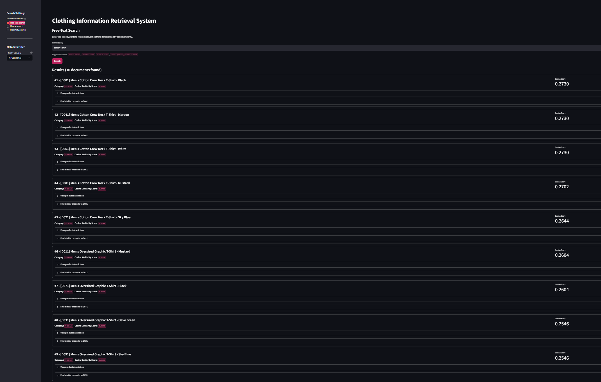

- Exact Phrase Search: Searching the exact phrase `cotton t-shirt` uses the positional index to enforce that `cotton` is immediately followed by `tshirt` (consecutive token positions). This restricts the results to only 5 documents (D001, D021, D041, D061, D081), each with verified start positions (such as position 15 or 17).

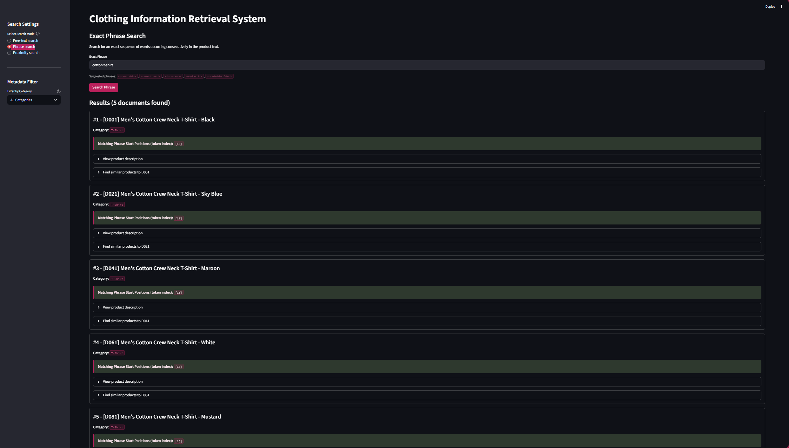

- Explanation: Ordinary VSM scores documents using term frequency and inverse document frequency across the entire document text regardless of distance. Positional indexing requires consecutive token offsets, eliminating false positives where the words appear separated in different sentences.

### Case 2: Word Order Sensitivity (Query: `stretch denim` vs. `denim stretch`)

- Free-Text VSM Search: Because the standard Vector Space Model is a bag-of-words model, it treats a query as an unordered collection of term weights. Searching `stretch denim` and searching `denim stretch` produce the exact same query vector. Both queries return the exact same 10 documents in the exact same ranking order with identical cosine scores (D013, D073, D043, D033, D093, D003, D063, D053, D029, D049).

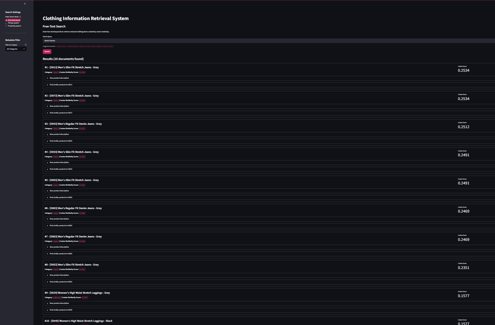
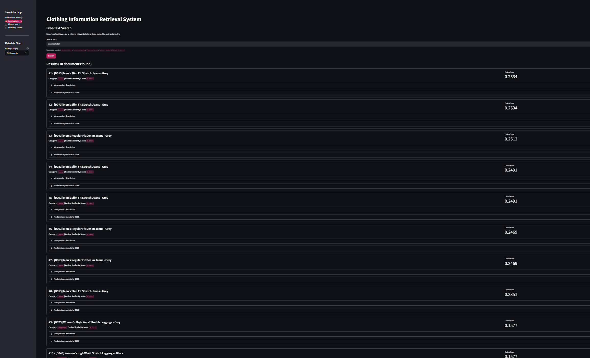

- Exact Phrase Search: Using positional indexing, the term order pos1 < pos2 is strictly enforced. Searching `stretch denim` matches 7 documents (D003, D013, D033, D043, D063, D073, D093) where the adjective precedes the noun. Searching the reversed phrase `denim stretch` returns 0 documents because the reverse sequence never occurs in the corpus.

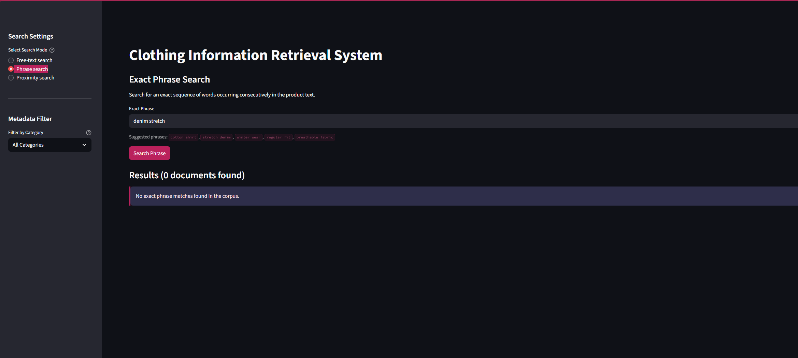

- Explanation: Positional retrieval accounts for word order and grammatical structure. In free-text VSM, term permutation has zero effect on ranking, whereas positional indexing distinguishes meaningful phrases from invalid word orders.

### Out-of-Vocabulary Query Handling (Query: `waterproof leather boots`)

The assignment requires testing at least one query containing terms that do not appear in the corpus. Searching `waterproof leather boots` results in 0 documents found because none of the query terms exist in the clothing vocabulary. The application handles this state gracefully without throwing errors or crashing:

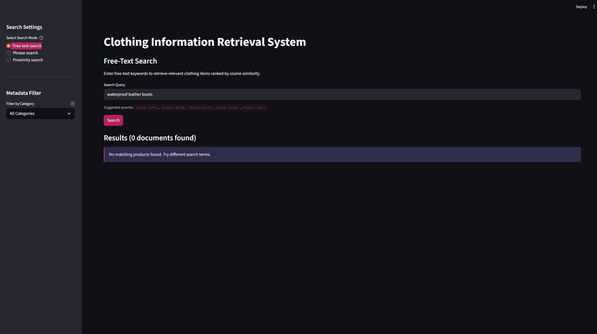

## Deliverables and Documentation Checklist

- [x] Complete assignment documentation in `README.md`:
  - [x] Document and justify stop-word policy.
  - [x] Document preprocessing decisions.
  - [x] Record results for mandatory test queries (10 free-text, 5 phrase, 3 proximity, 1 out-of-vocabulary).
  - [x] Include comparative analysis of two cases where positional information changes retrieval results.
- [x] Export index files to `deliverables/index_output_files/`:
  - [x] Export dictionary / inverted index output (`inverted_index.json`).
  - [x] Export positional index output (`positional_index.json`).
- [x] Capture application screenshots showing representative query results (`deliverables/representative_screenshots/`).
- [x] Package final submission into a single ZIP file.

